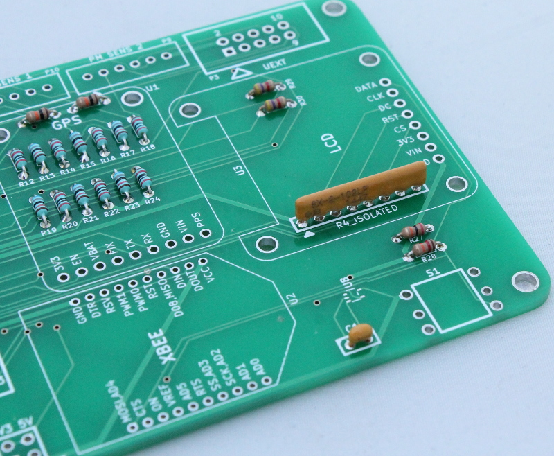
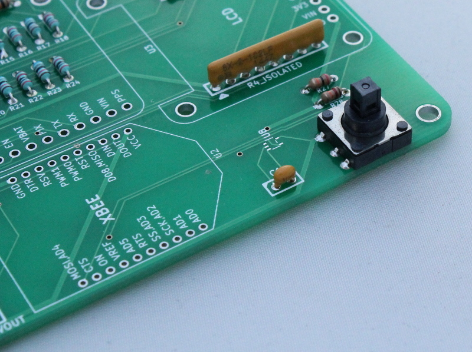

2) Joystick input circuit
===================================

A 5-position joystick toggle switch is used for accessing device configuration menus. It is not yet enabled in firmware.

In addition to the toggle switch (S1) the following additional components are required for the joystick circuit:

* 20K Resistor (R27)
* 12K Resistor (R28)
* 0.1 uF capactor (C1) 
* Resistor array (U7) 
* Schmitt buffer (U8)

Solder the resistors and capacitors onto the board as shown in the pictures below (no specific order). 

Solder the toggle switch onto the board.

   
Solder the Schmitt buffer onto the board (image to be added).