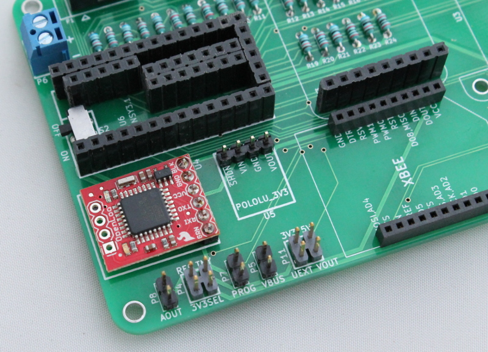
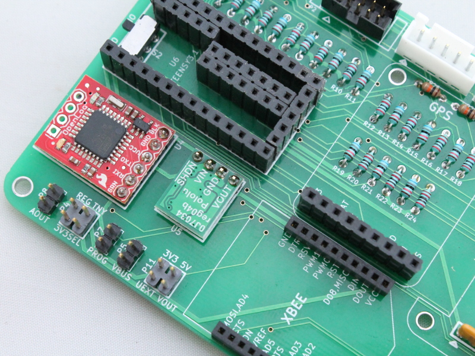
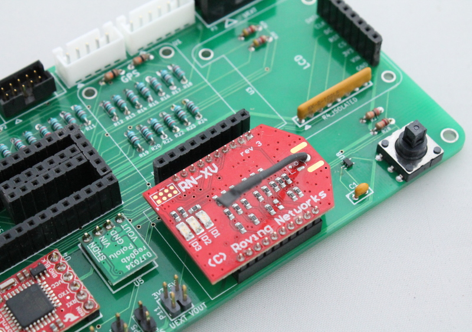
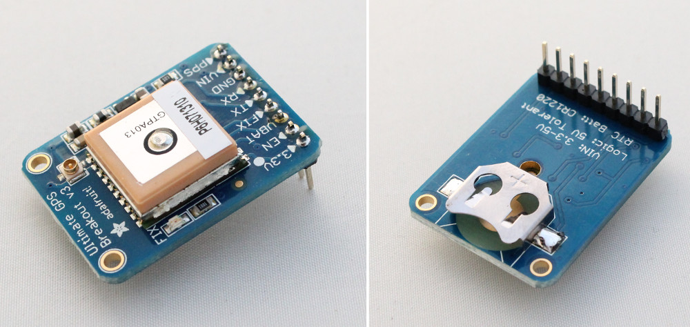
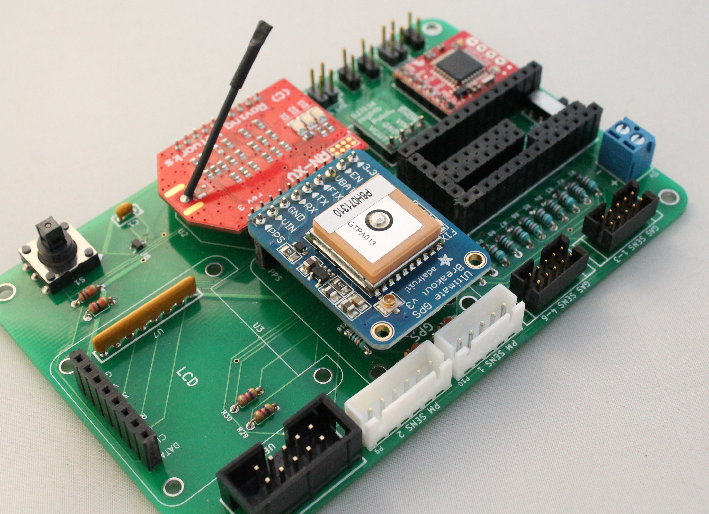
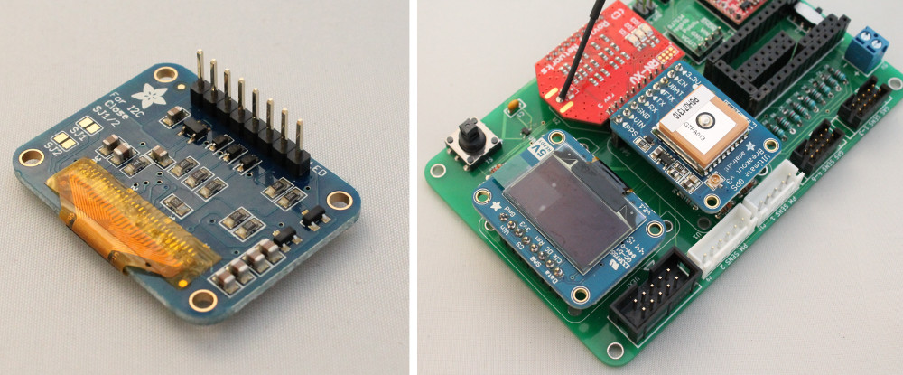

9) Placing large components
=====================================

   
OpenLog SD card data logger
----------------------------------

Place the OpenLog onto the 6-pin header and solder in place as shown in the image below.

   
Pololu 3V3  power regulator
----------------------------------

Place the Pololu 3V3 module onto the 4-pin header and solder in place as shown in the image below.

   
   
XBEE/WiFly wireless communication module
----------------------------------------------

Insert the XBEE RF module or Sparkfun RN-XV WiFly into the sockets as shown in the image below. 
   

   
   
Adafruit Ultimate GPS Breakout
------------------------------------

Adafruit GPS Breakout board comes with a 9-pin array. Solder this onto the breakout board as shown in the images below.
   

Insert the GPS board into the 9-position female header as shown in the image below.

   

   
Adafruit OLED graphic display
------------------------------------

The Adafruit graphic display comes with an 8-pin array. Solder this onto the board as shown in the image below and insert the LCD display into the 8-position female header.

   

   