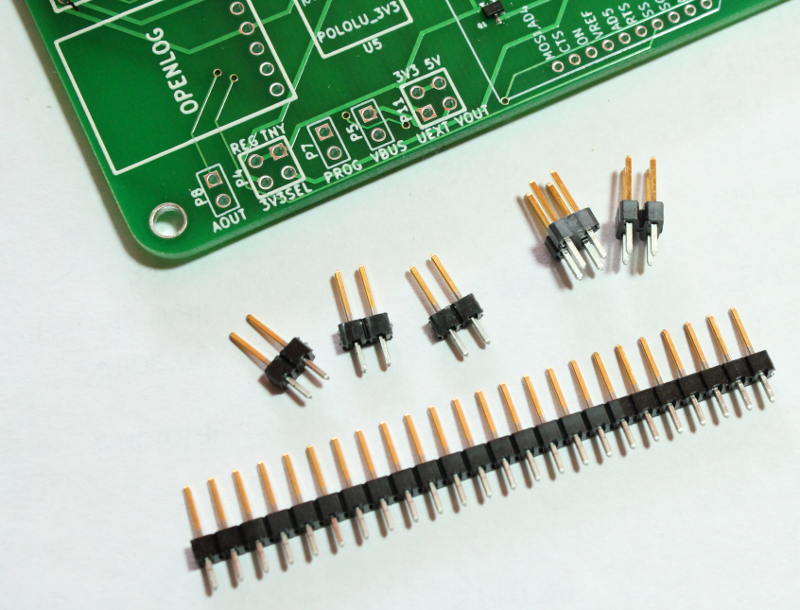
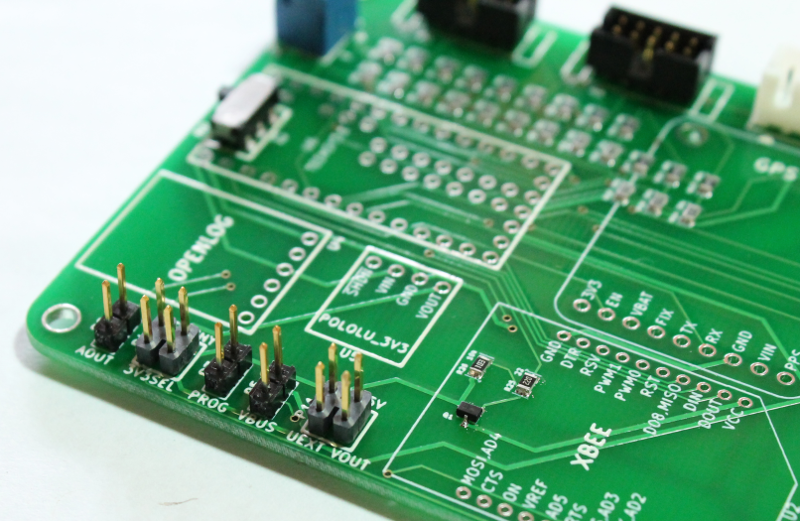

5) Configuration and expansion headers
===========================================

These pins provide access to additional features on the Teensy and some additional configuration options for the device.

* AOUT (P8) - This header provides access to the onboard DAC (digital to analog converter) on the Teensy.  
* 3V3SEL (P4) - Selects between the 3.3V regulator on the Teensy or the higher current external 3.3V Pololu regulator. You might use the higher current Pololu regulator when using the XBEE or WiFly.
* PROG (P7) - Provides access to the Teensy program signal which reboots the microcontroller into Bootloader mode. (Development option).
* VBUS (P5) - For connecting the external power to the Teensy. If you are using the external power you will want to put a jumper on the pins.
* UEXT VOUT (P11) - Selects the power for the UEXT expansion header, whether it is 5V or 3.3V. For example, to select 5V, place a jumper on the right pins.

Solder the 2x2 pins into positions P4 and P11.

Take the 36-position male breakaway header and break off 3 sets of 2-position headers. Solder these into positions P5, P7 and P8. Solder with the longer pin facing up.

   

   
 