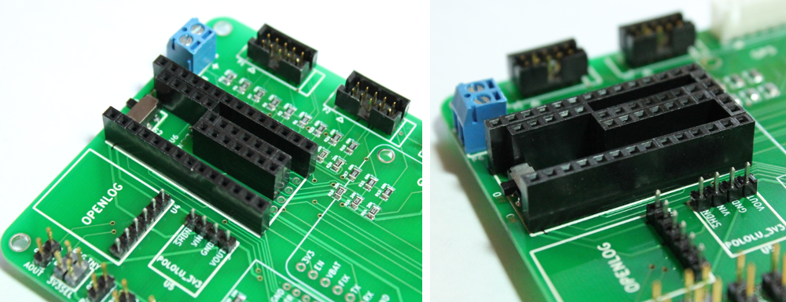

7) Teensy Headers
================================

There are 3 of the 36-position (pos) female breakaway headers. These breakaway headers can be cut into customs lengths using a pair of wire clippers.  

* Take one of the breakaway headers and cut off two 14-position headers. 
* Take a second breakaway header and cut off two 5-position headers and two 7-position headers. 
* Place the custom headers into the board at position U6 as shown in the image below. You may find that you will need to sand the rough edges of the headers where they were cut to get the headers to all fit into the board. 

|

These female headers will be used to connect the Teensy later in the instructions. 

.. figure:: _static/v4_7b.png
   :align:  center

